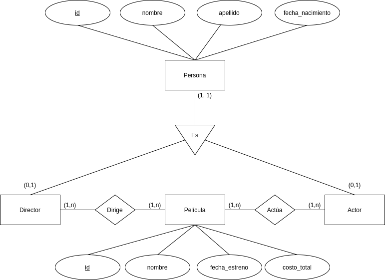
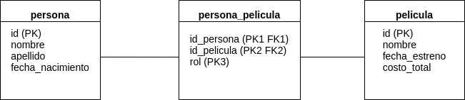

# Modelo E/R



# Tablas



# Algunas consultas

Personas, las películas en las que trabajaron, y bajo que rol:

```
SELECT CONCAT(persona.nombre, " ", persona.apellido) as "Nombre", pelicula.nombre as "Pelicula", persona_pelicula.rol as "Rol"
FROM persona JOIN persona_pelicula JOIN pelicula
ON  persona_pelicula.id_persona=persona.id
AND persona_pelicula.id_pelicula=pelicula.id;
```

Películas en las que trabajo Michael Bay (id 3) y bajo que rol lo hizo:

```
SELECT pelicula.nombre as "Pelicula", persona_pelicula.rol as "Rol"
FROM persona JOIN persona_pelicula JOIN pelicula
ON  persona_pelicula.id_persona=persona.id
AND persona_pelicula.id_pelicula=pelicula.id
AND persona.id=3;
```

Personas que trabajaron en la película Armageddon (id 3):

```
SELECT DISTINCT CONCAT(persona.nombre, " ", persona.apellido) as "Nombre"
FROM persona JOIN persona_pelicula JOIN pelicula
ON  persona_pelicula.id_persona=persona.id
AND persona_pelicula.id_pelicula=pelicula.id
AND pelicula.id=3;
```
